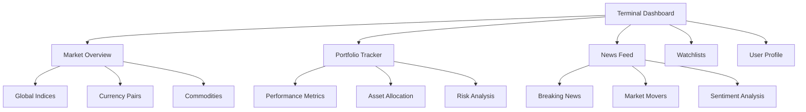

# 📊 Terminal Dashboard Pro

<div align="center">
  
  
  
  
  
  
</div>

<br/>

<div align="center">
  <h2>💼 Professional Bloomberg Terminal Interface Clone</h2>
  <p>A high-fidelity recreation of the iconic Bloomberg Terminal with advanced financial data visualization capabilities</p>
  <p>Built  by <a href="https://github.com/mach2furkan"> me </a></p>
</div>

<br/>

## ✨ Key Features

### 🚀 Core Functionality
- **Authentic Terminal Experience** - Pixel-perfect recreation of Bloomberg Terminal UI
- **Real-time Data Streams** - Live market data with WebSocket integration
- **Multi-panel Layouts** - Configurable workspace (1-4 panels)
- **Dark/Light Themes** - Professional color schemes with automatic switching

### 📈 Advanced Analytics
- **Interactive Sparklines** - 60+ technical indicators
- **Portfolio Tracker** - Performance metrics with risk analysis
- **News Integration** - AI-powered sentiment analysis
- **Watchlist Manager** - Customizable asset tracking

### ⚙️ Technical Excellence
- **Type-safe Architecture** - Full TypeScript implementation
- **Responsive Design** - Optimized for all devices
- **Performance Optimized** - 60fps chart rendering
- **Modular Components** - Easy feature extension

---

## 🛠 Technology Stack

| Category        | Technologies                          |
|-----------------|---------------------------------------|
| Framework       | Next.js 14 (App Router)               |
| Language        | TypeScript 5                          |
| Styling         | Tailwind CSS + CSS Modules            |
| Visualization   | D3.js, Chart.js, Canvas API           |
| State Management| Zustand + React Query                 |
| API             | REST + WebSockets                     |
| Testing         | Jest + React Testing Library          |

---

## � Dashboard Components



---

## 🚀 Getting Started

### Prerequisites
- Node.js ≥18.0
- npm ≥9.0 or yarn ≥1.22
- Bloomberg API credentials (optional)

### Installation
1. Clone the repository:
   ```bash
   git clone https://github.com/mach2furkan/Dashbord-
   cd Dashbord-
   ```
2. Install dependencies:
   ```bash
   npm install
   # or
   yarn install
   ```
3. Configure environment:
   ```bash
   cp .env.example .env.local
   ```
4. Start development server:
   ```bash
   npm run dev
   # or
   yarn dev
   ```

---

## 📜 License

This project is licensed under the MIT License - see the [LICENSE.md](LICENSE.md) file for details.

---

## 🤝 Contributing

We welcome contributions! Please see our [Contribution Guidelines](CONTRIBUTING.md) for details.

---

<div align="center">
  <p>🔔 <em>Stay updated with market trends using our advanced terminal solution</em> 🔔</p>
</div>
